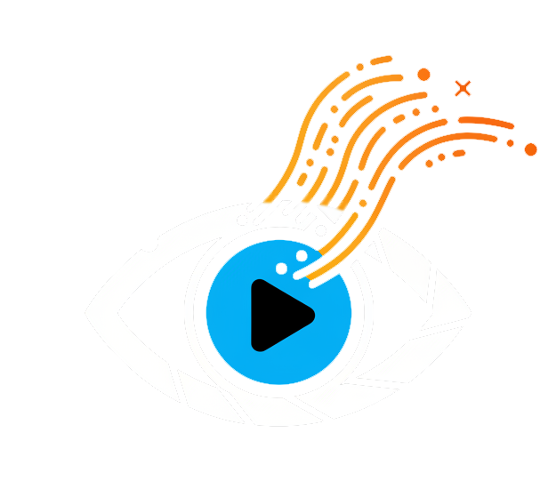
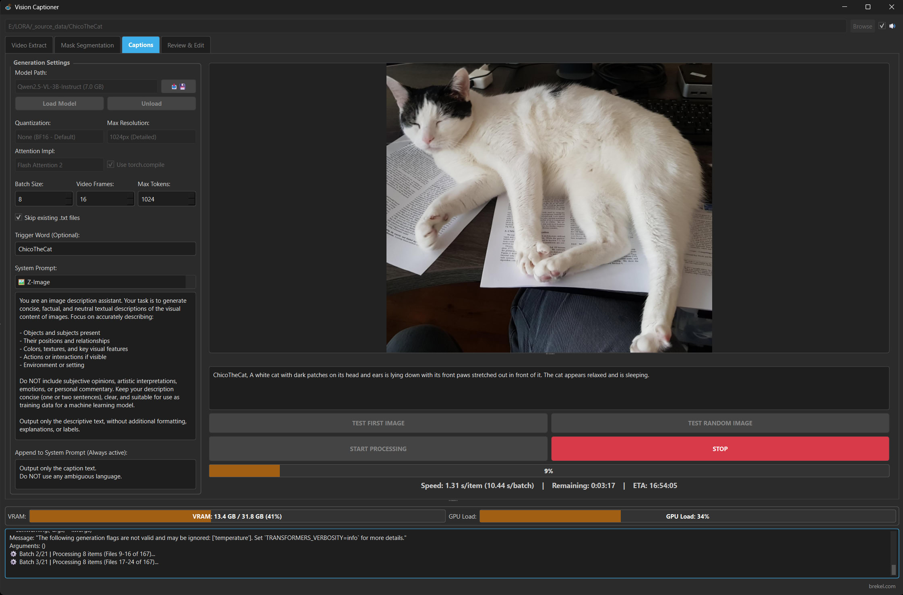

# VisionCaptioner
<p align="center">
  
</p>

**VisionCaptioner** is a local desktop application designed to automate the creation of detailed captions for image & video datasets. 

Built specifically for AI researchers and enthusiasts training custom models (LoRA, Fine-tuning, Flux, Z-Image Turbo, Qwen-Image, SDXL, Wan, HunyuanVideo etc). VisionCaptioner leverages the **Qwen-VL** family of Vision-Language Models to generate high-quality, context-aware descriptions in batch. 



## **✨ Features**

*   **User-Friendly Interface:** Simple GUI to manage your image & video captioning tasks.
*   **Caption generation** Automatically generate captions using Qwen-VL models.
    *   **Video Support:** Unlike other tools, this analyzes video files by extracting multiple frames to understand motion and context.
    *   **LoRA Friendly:** Includes features specifically for training, such as **Trigger Word** injection and skipping existing caption files.
    *   **Review & Edit** Quickly review and manually edit your captions on a dataset.
    *   **Find & Replace** Functionality to find and replace strings in your captions dataset, including often used presets.
    *   **System Prompts:** Choose from built-in presets (tuned for various models) or write your own custom instructions.
    *   **Resolution & Quantization:** Adjustable settings to balance between speed, VRAM usage, and descriptive detail.
    *   **Works with many Qwen-VL models** QwenVL-2.5, QwenVL-3, base models, Abliterated versions, GGUF models
*   **Masking Support:** Functionality to create mask files using Segment Anything 3 model with promptable subject.
    *   **Editing** Functionality to quickly paint/edit/extract/contract masks in a visual editor.
    *   **Different mask formats** Masks can be saved as separate files or embedded in the image files.
    *   **Compatibility with [OneTrainer](https://github.com/Nerogar/OneTrainer)**
    *   **Potentially compatible with other/future training tools**
*   **Video Extraction** Functionality to extract frames from videos containing a prompted subject.
*   **Local Execution:** Runs entirely on your machine for privacy and control.
*   **CommandLine Interface:** Option to use this from the commandline and/or scripts.

## **🛠️ Installation**

### **Prerequisites**
*   **Python 3.10+**
*   **NVIDIA GPU** (CUDA support is required).

### Linux Setup

**Python Setup:**
```bash
git clone https://github.com/Brekel/VisionCaptioner.git
cd VisionCaptioner
python3 -m venv venv
source venv/bin/activate
pip3 install torch torchvision
pip3 install -r requirements.txt
```

**Qt/GUI Dependencies (Ubuntu/Debian):**

Some Linux systems may require additional packages for the Qt-based GUI to work:
```bash
sudo apt install libxcb-cursor0 libxcb-xinerama0 libxcb-icccm4 libxcb-image0 libxcb-keysyms1 libxcb-randr0 libxcb-render-util0 libxcb-shape0 libxcb-xfixes0 libxcb-xkb1 libxkbcommon-x11-0
```

### Windows Setup
```bash
git clone https://github.com/Brekel/VisionCaptioner.git
cd VisionCaptioner
python -m venv venv
.\venv\Scripts\activate
pip install torch torchvision --index-url https://download.pytorch.org/whl/cu130
pip install -r requirements.txt
```

## **🚀 Launching the Application**
You can start the application using the provided scripts or manually via Python.

**Start manually:**
```bash
python main.py
```
**Or using the run.bat (Windows) or run.sh (Linux) scripts**

## **📥 Download/Install Models**
* Models can be installed using the built-in downloads manager on the Captions tab (📥💾 button).
* Alternatively, you can manually download models from HuggingFace into the /models folder.
* More info in the [readme_models.md](readme_models.md) file.


## **📖 General Usage**
* First select your Image/Video folder at the top (using Browse button or drag & drop) 
* Note that all settings have a tooltip description if you hover your mouse over them
* Use the [Captions tab](readme_captions.md) to generate captions for images and videos
* Use the [Review & Edit tab](readme_review.md) to review and edit captions
* Use the [Video Extraction tab](readme_video_extract.md) to extract frames from videos
* Use the [Mask Segmentation tab](readme_mask_segmentation.md) to create masks for images (this is optional)

## **🖥️ CLI - Command Line Interface usage**
* For advanced users, the tool can be used from the commandline or scripts
* It will automatically read the settings.json file generated by the user
* Parameters can be overruled on the commandline
* Please refer to [commandline_interface.md](commandline_interface.md) for documentation

## Acknowledgements
Qwen Team: Alibaba Cloud - For developing and open-sourcing the powerful [Qwen-VL models](https://github.com/QwenLM/Qwen3-VL).

Meta AI - For developing and open-sourcing the [Segment Anything Model 3 (SAM3)](https://github.com/facebookresearch/sam3).

This project was inspired by:

AI Lab's ComfyUI-QwenVL node for ComfyUI:
* [https://github.com/1038lab/ComfyUI-QwenVL](https://github.com/1038lab/ComfyUI-QwenVL)

OneTrainer and its masked training features:
* [https://github.com/Nerogar/OneTrainer](https://github.com/Nerogar/OneTrainer)

---

## **🙏 Citation & Support**
If you find this tool useful in your research or projects, please consider:
*   Giving a ⭐ on [GitHub](https://github.com/Brekel/VisionCaptioner).
*   Citing the project as: **Brekel - VisionCaptioner (https://brekel.com)**.
*   Follow on Twitter/X: https://x.com/brekelj
*   Checking out other tools at [brekel.com](https://brekel.com).