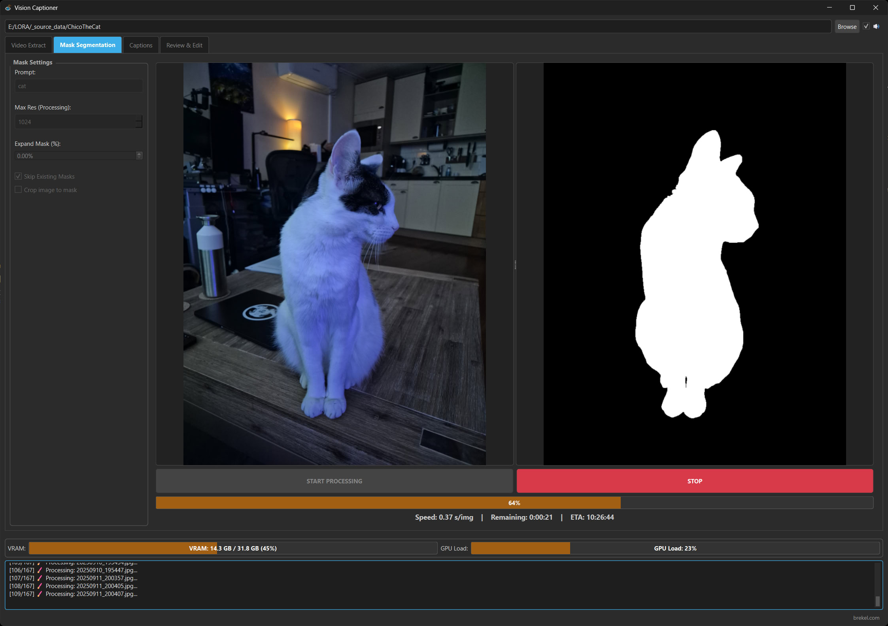

# Mask Segmentation tab

The Mask Segmentation tab is used to generate masks for images (masks for videos are currently not supported).

* Masks are optional but can for example be used with [OneTrainer](https://github.com/Nerogar/OneTrainer) and its masked training features.
* Masks are generated using the Segment Anything 3 Model (SAM3). Please see the [readme_models.md](readme_models.md) for more information on how to download and install models.
* To generate masks start by defining the "Prompt", this will be the subject you want to mask. For example "cat", or "person", or "woman" etc.
* You can optionally change the other settings, they have tooltips to explain what they do.
* Hit "START PROCESSING" to process all files in your folder.
* For each image file a mask will be generated and saved in the same folder as the image file with the same name but with "-masklabel" appended to the filename and in the PNG file format.
* The "Separate File (*-masklabel.png) file naming scheme is directly compatible with [OneTrainer](https://github.com/Nerogar/OneTrainer).
* For other training tools you may want to experiment with the other file naming schemes.