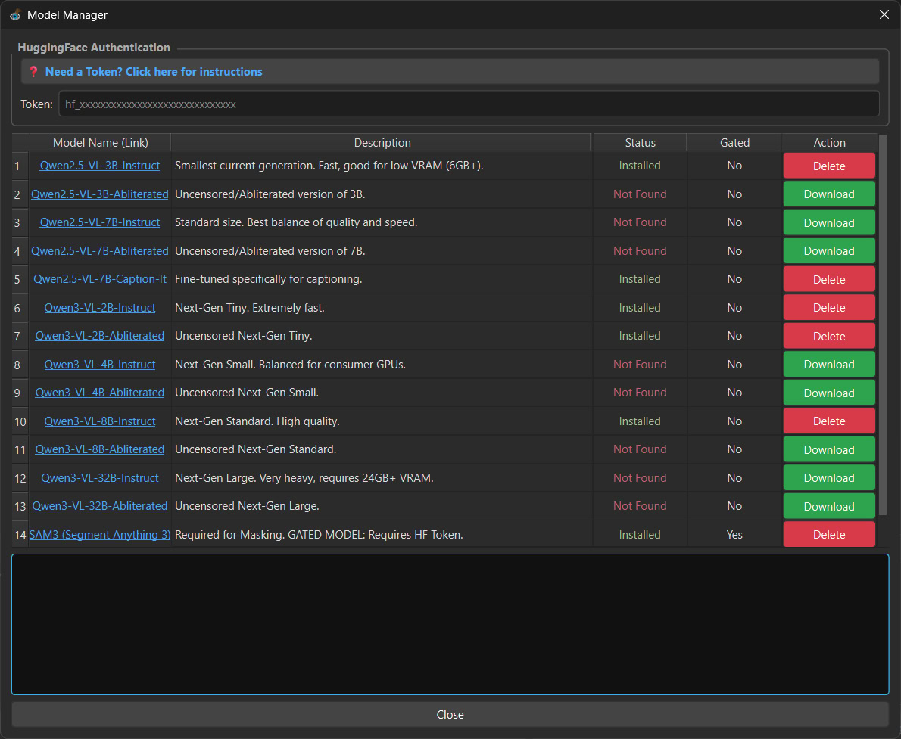

# **Models**

Models can be downloaded using the built-in downloads manager on the Captions tab (📥💾 button).

* To download a model simply click the "Download" button, the model will be downloaded into the /models folder.
* Note that for "Gated" models like SAM3 you will need to log in to HuggingFace first and generate an Authentication Token.
  Check the info at the top of the window for more details.

## **Manual Download**

Alternatively, you can manually download models from HuggingFace into the /models folder. You will need Qwen3-VL or Qwen2.5-VL models, developed by the Qwen Team at Alibaba Cloud.

Abliterated (uncensored) models should work as well.
| Model | Link |
| :---- | :---- |
| Qwen2.5-VL-3B-Instruct | [HugginFace link](https://huggingface.co/Qwen/Qwen2.5-VL-3B-Instruct) |
| Qwen2.5-VL-7B-Instruct | [HugginFace link](https://huggingface.co/Qwen/Qwen2.5-VL-7B-Instruct) |
| Qwen2.5-VL Abliterated | [HugginFace link](https://huggingface.co/collections/huihui-ai/qwen25-vl-abliterated) |
| Qwen2.5-VL Abliterated Caption-It | [HugginFace link](https://huggingface.co/prithivMLmods/Qwen2.5-VL-7B-Abliterated-Caption-it) |
| Qwen3-VL-2B-Instruct | [HugginFace link](https://huggingface.co/Qwen/Qwen3-VL-2B-Instruct) |
| Qwen3-VL-4B-Instruct | [HugginFace link](https://huggingface.co/Qwen/Qwen3-VL-4B-Instruct) |
| Qwen3-VL-8B-Instruct | [HugginFace link](https://huggingface.co/Qwen/Qwen3-VL-8B-Instruct) |
| Qwen3-VL-32B-Instruct | [HugginFace link](https://huggingface.co/Qwen/Qwen3-VL-32B-Instruct) |
| Qwen3-VL Abliterated | [HugginFace link](https://huggingface.co/collections/huihui-ai/qwen3-vl-abliterated) |

## **GGUF Models**

Models in GGUF format are supported, but require a manual installation process.
* For GGUF models to work you need to install the llama-cpp-python package:
    * pip install llama-cpp-python __does not__ work!
    * you need the latest version from [GitHub](https://github.com/JamePeng/llama-cpp-python/releases)
    * download the correct wheel file for your system and install it using pip
* Make sure you download the GGUF version of the model and don't forget the accompanying mmproj file.
