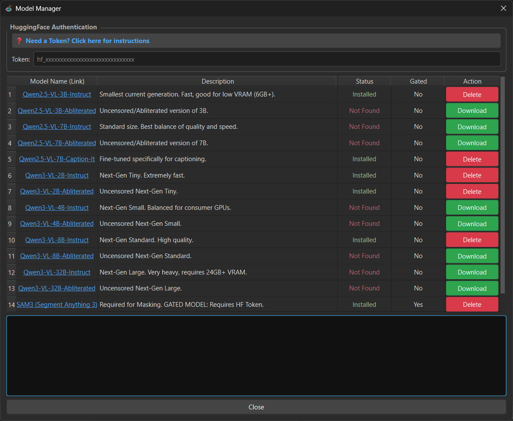

# **Models**

Models can be downloaded using the built-in downloads manager on the Captions tab (📥💾 button).



* To download a model simply click the "Download" button, the model will be downloaded into the /models folder.
* Note that for "Gated" models like SAM3 you will need to log in to HuggingFace first and generate an Authentication Token.
  Check the info at the top of the window for more details.


## **Supported Model Families**

VisionCaptioner currently supports two Vision-Language Model families:

* **Qwen-VL** (Qwen2.5-VL, Qwen3-VL) — developed by the Qwen Team at Alibaba Cloud.
* **Google Gemma 4** (E2B, E4B, 26B-A4B MoE, 31B) — developed by Google DeepMind.

Abliterated (uncensored) variants of both families should work as well, since they share the same architecture as the base models.

## **Manual Download**

Alternatively, you can manually download models from HuggingFace into the /models folder.

### Qwen-VL Models
| Model | Link |
| :---- | :---- |
| Qwen2.5-VL-3B-Instruct | [HuggingFace link](https://huggingface.co/Qwen/Qwen2.5-VL-3B-Instruct) |
| Qwen2.5-VL-7B-Instruct | [HuggingFace link](https://huggingface.co/Qwen/Qwen2.5-VL-7B-Instruct) |
| Qwen2.5-VL Abliterated | [HuggingFace link](https://huggingface.co/collections/huihui-ai/qwen25-vl-abliterated) |
| Qwen2.5-VL Abliterated Caption-It | [HuggingFace link](https://huggingface.co/prithivMLmods/Qwen2.5-VL-7B-Abliterated-Caption-it) |
| Qwen3-VL-2B-Instruct | [HuggingFace link](https://huggingface.co/Qwen/Qwen3-VL-2B-Instruct) |
| Qwen3-VL-4B-Instruct | [HuggingFace link](https://huggingface.co/Qwen/Qwen3-VL-4B-Instruct) |
| Qwen3-VL-8B-Instruct | [HuggingFace link](https://huggingface.co/Qwen/Qwen3-VL-8B-Instruct) |
| Qwen3-VL-32B-Instruct | [HuggingFace link](https://huggingface.co/Qwen/Qwen3-VL-32B-Instruct) |
| Qwen3-VL Abliterated | [HuggingFace link](https://huggingface.co/collections/huihui-ai/qwen3-vl-abliterated) |

### Google Gemma 4 Models
| Model | Link |
| :---- | :---- |
| Gemma-4-E2B-it | [HuggingFace link](https://huggingface.co/google/gemma-4-E2B-it) |
| Gemma-4-E4B-it | [HuggingFace link](https://huggingface.co/google/gemma-4-E4B-it) |
| Gemma-4-26B-A4B-it | [HuggingFace link](https://huggingface.co/google/gemma-4-26B-A4B-it) |
| Gemma-4-31B-it | [HuggingFace link](https://huggingface.co/google/gemma-4-31B-it) |
| Gemma 4 Abliterated | [HuggingFace link](https://huggingface.co/collections/huihui-ai/gemma-4-abliterated) |

## **Gemma 4 Specific Settings**

When a Gemma 4 model is selected, an extra **Vision Tokens** dropdown becomes active in the Captions tab. This controls the soft visual token budget per image:

| Budget | Use case |
| :----- | :------- |
| 70 | Fastest, lowest VRAM, coarse detail |
| 140 | Fast |
| 280 | Default — good balance |
| 560 | Detailed |
| 1120 | Maximum detail, highest VRAM |

The "Max Resolution" setting is ignored for Gemma 4 — Gemma's processor handles its own resizing based on the vision token budget. For Qwen models the Vision Tokens dropdown is greyed out and "Max Resolution" controls detail instead.

> **Note:** Gemma 4's built-in "thinking" mode is automatically disabled for captioning, since reasoning tokens add latency without improving caption quality.

## **GGUF Models**

Models in GGUF format are supported for the **Qwen-VL** and **Gemma 4** families. GGUF support requires the `llama-cpp-python` package from [JamePeng/llama-cpp-python](https://github.com/JamePeng/llama-cpp-python/releases).

### Automatic Install (recommended)
When you try to load a GGUF model without `llama-cpp-python` installed, VisionCaptioner will offer to install it for you. It automatically detects your Python version, operating system, and CUDA version, then downloads and installs the matching wheel from GitHub. The log shows exactly which package was selected so you can verify the choice.

### Manual Install
If you prefer to install manually:
* pip install llama-cpp-python __does not__ work!
* You need the latest version from [JamePeng/llama-cpp-python on GitHub](https://github.com/JamePeng/llama-cpp-python/releases)
* Pick the wheel that matches your system:
  * **CUDA version**: cu124, cu126, cu128, or cu130 (check via `python -c "import torch; print(torch.version.cuda)"`)
  * **Platform**: win (Windows), linux, or Metal (macOS)
  * **Python version**: cp310, cp311, cp312, cp313, etc.
* Install with: `pip install <url-to-wheel-file>`

### GGUF Model Notes
* Make sure you download the GGUF version of the model and don't forget the accompanying mmproj file.

### Vision projector (mmproj) files
A GGUF that has no vision tensors of its own needs a separate **mmproj** (multimodal projector) file to see images. There is no setting for it — **just put the mmproj file in the same folder as the model** and VisionCaptioner finds it:

* Any file in that folder matching `*mmproj*.gguf` is a candidate, whatever it is called. The generic names the model publishers ship (`mmproj-F16.gguf`, `mmproj-BF16.gguf`) are fine.
* The right one is picked by reading its metadata: a projector fits only if `clip.vision.projection_dim` equals the model's own embedding width. So a folder holding projectors for several models still pairs each one correctly, and a projector belonging to a different model is rejected rather than loaded.
* Filenames are only used to break a tie between projectors that are all a valid fit.

Check the log after loading a model — it says which projector was chosen, and the load message ends in **(Vision Enabled)**:

```
✅ Projector matched on projection_dim=2560: mmproj-F16.gguf
GGUF Loaded ✅ (Vision Enabled) — image mode (n_ctx=8192, n_batch=512)
```

If it says **(Text Only)** instead, no projector was paired and every caption will be invented from the prompt alone. The log above it says why — either no `*mmproj*.gguf` was found in the folder, or the ones there project a different width and belong to another model.

### Gemma 4 GGUF
Gemma 4 GGUF models (e.g. from `unsloth/gemma-4-*-GGUF`) are supported and require llama-cpp-python **v0.3.35 or newer** from [JamePeng/llama-cpp-python](https://github.com/JamePeng/llama-cpp-python/releases). Older versions do not include the Gemma4ChatHandler and will show an error asking you to update. The Vision Token Budget setting does not apply to GGUF models — it is automatically greyed out. Thinking mode is handled internally by the chat handler.
