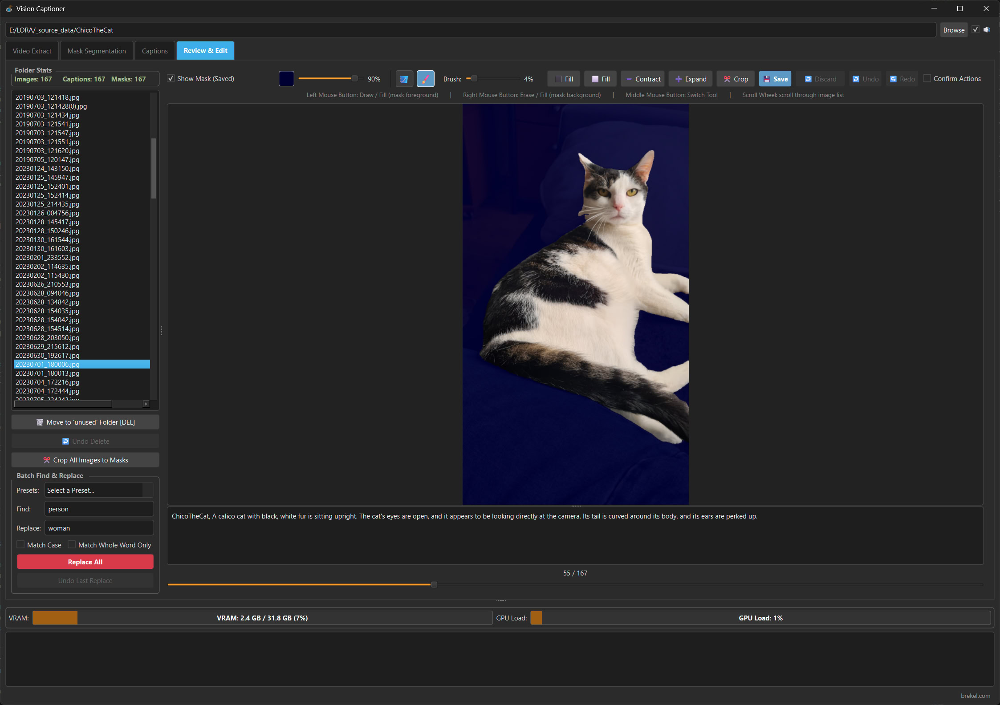

# Review & Edit tab

The Review & Edit tab is used to review and edit your captions and masks.

## Left Hand Side
* Here you can select a file from the list to review and edit its caption and mask.
* Stats are displayed to easily see if there are missing Captions and/or Masks.
* There are tools to delete files (they are moved to a subfolder named "unused").
* There are tools to find/replace text elements in all files at once.
  * You can define search & replace presets, have a look at the [search_replace_presets.json](search_replace_presets.json) file.

## Right Hand Side
* Here you can see the caption and mask for the selected file.
* Captions can be edited directly, they are automatically saved
* Masks can be edited using various tools available in the toolbar (see tool tips for details and keyboard shortcuts)
* Disabling the "Confirm Actions" toggle allows advanced users to move very quickly auto saving files as they go