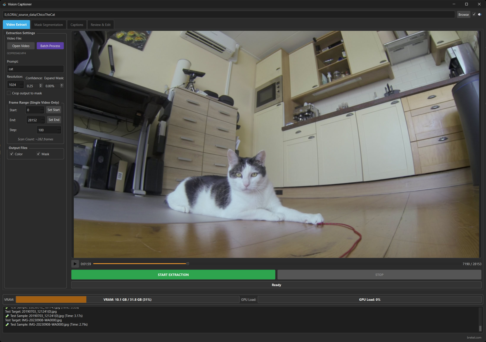

# Video Extract tab

The Video Extract tab is used to extract frames from videos.

* You can select "Open Video" or drop a video file into the window to open a video.
* Using the Play button and timeline bar you can scrub through your video to review it.
* Using "Batch Process" you can process multiple videos at once.
* Instead of extracting every frame, several features are used to extract only relevant frames.
  * Defining the "Prompt" will extract only frames containing that subject.
  This uses the Segment Anything 3 Model (SAM3). Please see the [readme_models.md](readme_models.md) for more information on how to download and install models.
  * The "Start" and "End" frames define the range of frames to extract. You can use the slider below the preview to scrub through your video and the "Set Start" and "Set End" buttons to set the start and end frames.
  * "Step" defines how many frames to skip between each frame, an indication will be given to the maximum amount of frames that will be extracted. (if the subject of your prompt is visible in those frames)
* Hit "START EXTRACTION" to process the frames of your video.